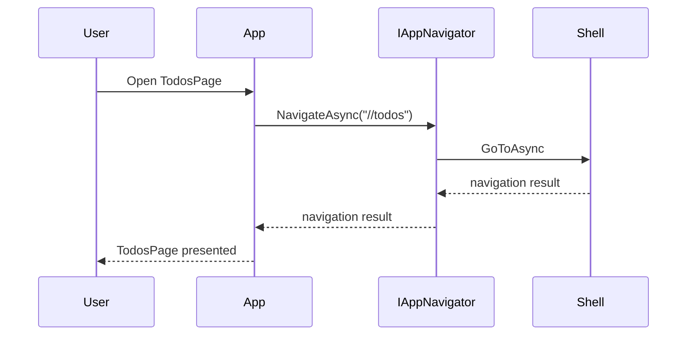

# High Level Architecture

TodoApp is built with the least depedencies as possible, as you already see in [README](../readme.me) file.
However, the app strictly follows best practices for a typical Xamarin.Forms application in MVVM and could be used as the template for any new XF applications.

## Component Diagram
The app is designed in which its screens will be grouped into features.
Each feature is a small MVVM group with M-V-VM and other supporting classes.

<image src="./images/high-level-components.png" />

## Folder structure
```
--docs
--src
----TodoApp
------Core                // Contains core classes and components used by features
--------Converters        // - Contains shared value converters
--------Dal               // - Contains database access logic 
--------Api               // - Contains API request logic 
--------Mvvm              // - Contains MVVM bases
--------Navigation        // - Contains Navigator and its helper
------Features            // Groups components by feature
--------Todos             // - A group for Todos feature
------UI                  // Contains UI only classes/components
--------Effects           // - Contains custom effects
--------MarkupExtensions  // - Contains custom markup extensions
--------Colors            // - Contains color used across the app
--------Dimens            // - Contains dimension values including spacing, font sizes, etc
--------Fonts             // - Contains custom fonts
----TodoApp.Android
------Effects
----TodoApp.iOS
------Effects
--tests
----TodoApp.Tests         // Contains non-ui tests
----TodoApp.UITests       // Contains UI tests
```

## Navigation

**1) Overview**

We don't need another framework or library such as Prism or FreshMvvm. 
All navigations within the app could be done perfectly with Shell navigation.

To make our VMs really easy to test and not depend on Shell navigation, there is an interface, `IAppNavigator`, to abstract the way we go back and forth between pages.

All the page navigations are defined in `AppShell.xaml` and `AppShell.xaml.cs` files.

```xaml
<ShellContent
    Route="Todos"
    ContentTemplate="{DataTemplate app:TodosPage}" />
```

```c#
Routing.RegisterRoute("new-todo", typeof(NewTodoPage));
```

**2) How to pass data between pages**

We do navigation based on Shell, we also pass data its way with the use of `IQueryableAttribute`.

Data are serialized in JSON while passing between pages. The serialization and deserialization of this data is hidden from our actual usages
- within AppNavigator while attaching data to the navigation URI
- within an extension for `IDictionary<string, string>` while getting out the data in the desired strongly type.

**3) Navigation Events**

Wit the help of our custom `AppNavigator` and several base VMs, we could distinguish two diferent navigation events

- `OnInit`: When we open the page for the firs time
- `OnBack`: When we go back from the subsequence page

The base VMs are

- `OnBackAwareViewModel`: Use this one if we only care about `OnBack` event
- `OnInitAwareViewModel`: Use this one if we only care about `OnInit` event
- `NavigationAwareBaseViewModel`: Use this one if we care about both `OnBack` and `OnInit` events

**4) Sequene diagram**



## Dependency Injection

To make components easisy to wire up togehter, but loosely coupled, we use DryIoC for dependency injection.

All dependencies are declared within `MauiProgram.cs` in method `RegisterServices`.

```
static MauiAppBuilder RegisterServices(this MauiAppBuilder builder)
{
    builder.Services.AddSingleton<IAppNavigator, AppNavigator>();
    builder.Services.AddSingleton<IRepository<TodoEntity>, Repository<TodoEntity>>();
    builder.Services.AddSingleton<TodosDbContext>();

    builder.Services.AddSingleton<TodosService>();

    return builder;
}
```

## View and ViewModel

**1) Wire up**

To wire up View and ViewModel, we have the view model as the construct parameter of the view

```
public NewTodoPage(NewTodoPageViewModel vm)
{
    InitializeComponent();

    BindingContext = vm;
}
```

**2) Page lifecycle**

Apart from navigation events, we also listen for page appearing and dispearing events.

To make this happen, we define two base classes

- `BasePage`: To check for the base VM and invoke the right method for each event
- `BaseViewModel`: To define corresponding async methods for page events

```
BasePage.OnAppearing        <-------->      BaseViewModel.OnAppearignAsync

BasePage.OnDisappearing     <-------->      BaseViewModel.OnDisappearignAsync
```

## Database

We use SQLite as the local database for the app with the help of [EFCore SQLite](https://docs.microsoft.com/en-us/ef/core/get-started/xamarin).

On top of EFCore, we define generic repository class and concrete repositories which follow [Repository Pattern](https://docs.microsoft.com/en-us/dotnet/architecture/microservices/microservice-ddd-cqrs-patterns/infrastructure-persistence-layer-design#:~:text=of%20Work%20patterns.-,The%20Repository%20pattern,from%20the%20domain%20model%20layer.) to avoid DRY and make things easier to extend and maintain.

## DTOs vs Entities vs Models

- DTOs: Classes for transfering data via Restful APIs or communicating with 3rd-party APIs
- Entities: Classes for storing data in our local database
- Models: Classes for binding data on the UI

In many apps, you might combine these 3 into single class, but it isn't a good practice and make things hard to change or always have to change. By separating them, we could freely define the right thing for the right purpose. 

E.g. 
- Model in MVVM usually comes with Property Changed.
- Entity in Realm must inherits from RealmObject, and cannot have its sub class
- DTO in Restful API usualy has JSON attributes